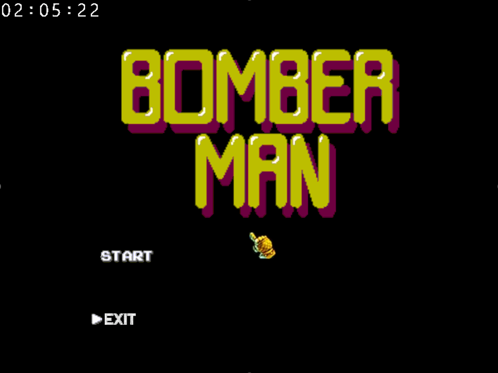
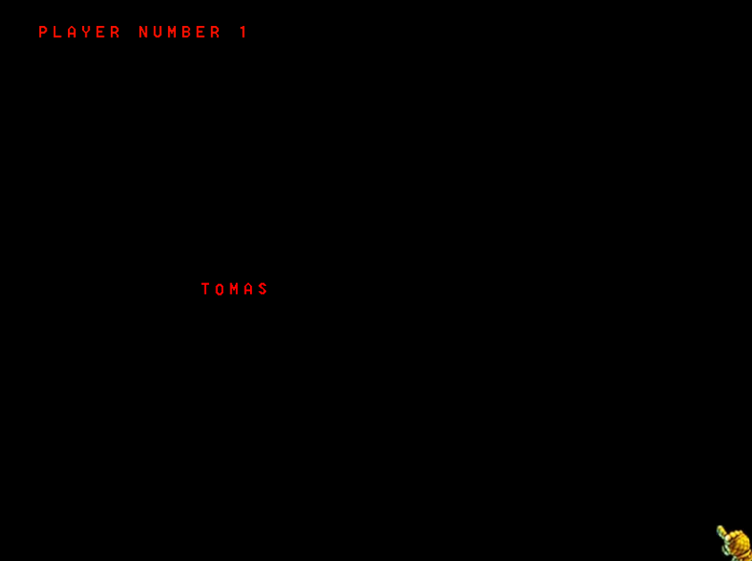
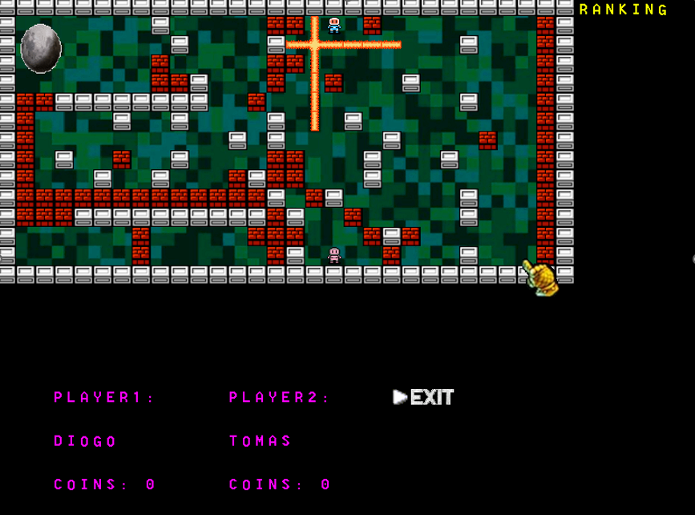
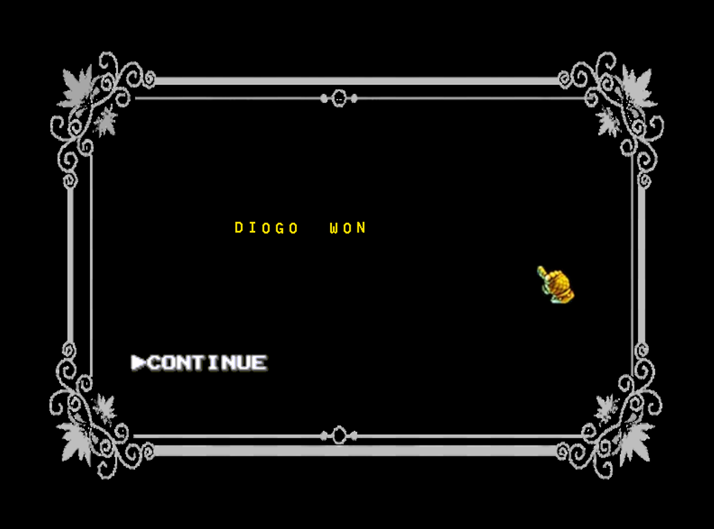

# Bomberman for MINIX 💣


This is a multiplayer top-down **Bomberman** clone developed for MINIX as the final project for the **LCOM** (Computer and Microprocessor Laboratory) course at **FEUP** (Faculty of Engineering of the University of Porto).

## 📖 About the Game
The objective of the game is to be the last player standing. Players navigate through a grid-based arena, dropping bombs to destroy breakable bricks and eliminate their opponents. 

Destroying bricks may reveal hidden coins that players can collect to increase their score. The game features a dynamic environment, custom sprite animations, and a fully functional graphical user interface.

## ✨ Features
* **Multiplayer Gameplay:** Local 2-player competitive mode.
* **Dynamic Day/Night Cycle:** The game background changes based on the real-world time (Daytime with a sun and bright grass between 08:00 and 20:00; Nighttime with a moon and dark grass otherwise).
* **Custom UI & Menus:** Interactive main menu, username input screens, and a game-over leaderboard screen.
* **Custom Font Rendering:** Text is rendered using a custom modular bitmap font system.
* **Smooth Graphics:** Implements double-buffering (page flipping) for tear-free rendering at 20 FPS.

## 🎮 Controls

### Player 1
* **Movement:** `W` `A` `S` `D`
* **Drop Bomb:** `Spacebar`

### Player 2
* **Movement:** `Numpad Arrows` (or `8` `4` `2` `6`)
* **Drop Bomb:** `Numpad 0`

### General / UI
* **Menu Navigation:** Mouse movement and Left-Click (or `W`/`S` and `Enter`).
* **Username Input:** Keyboard letters (`A-Z`) and `Enter` to confirm.
* **Exit Game:** `ESC` (can be pressed at any time to leave the game).

## 💻 Hardware Devices & Implementation

This project interacts directly with the PC's hardware peripherals at a low level:

* **Video Card (VBE):** Operates in graphics mode `0x115` (800x600 resolution, 24-bit direct color). Handles all drawing operations, sprite rendering (XPMs), and page flipping.
* **Timer (i8254):** Configured to run at 20 interrupts per second (20 FPS). Controls the game loop, sprite animations, movement speed, bomb explosion countdowns, and game-over timeouts.
* **Keyboard (i8042 KBC):** Handles scancodes for player movement, bomb deployment, menu navigation, and typing usernames.
* **Mouse (PS/2):** Handles packet parsing for cursor movement and button clicks in the menus.
* **RTC (Real-Time Clock):** Reads the current system time to display a live clock on the main menu and to toggle the in-game Day/Night background.

## 🏗️ Architecture

The game logic is built upon a **State Machine** architecture, seamlessly transitioning between different game states:
1. `MENU`: Main menu with Start and Exit options.
2. `SELECT_NAMES`: Text input state for Player 1 and Player 2.
3. `GAME`: The main gameplay loop and arena rendering.
4. `MESSAGE` (Game Over): Displays the winner (or a tie) and the coin leaderboard, with an option to return to the menu.

## 📸 Screenshots

*(Note: Add your actual image files to a `docs/` or `assets/` folder and update the paths below)*

| Main Menu | Username Input |
| :---: | :---: |
|  |  |

| Gameplay Arena | Game Over Screen |
| :---: | :---: |
|  |  |

## 🚀 How to Run

To compile and run this project on MINIX 3:

1. Clone this repository into your MINIX environment.
2. Navigate to the project directory:
   ```bash
   cd /path/to/project
   ```
3. Compile the source code using `make`:
   ```bash
   make
   ```
4. Run the executable using the LCOM script:
   ```bash
   lcom_run proj
   ```

## 🔮 Future Improvements
* **New Maps:** Adding different levels to increase gameplay variability.
* **Power-ups:** More special items that grant permanent or temporary abilities (e.g., increased speed, larger explosion radius) to give brave players an advantage.

## 👥 Authors
**Class 4 - group 2 (2022/2023)**
* Diogo Sarmento (up202109663)
* Rodrigo Póvoa (up202108890)
* Tomás Câmara (up202108665)
* Tomás Sarmento (up202108778)

---
*Developed for the LCOM course at FEUP.*
